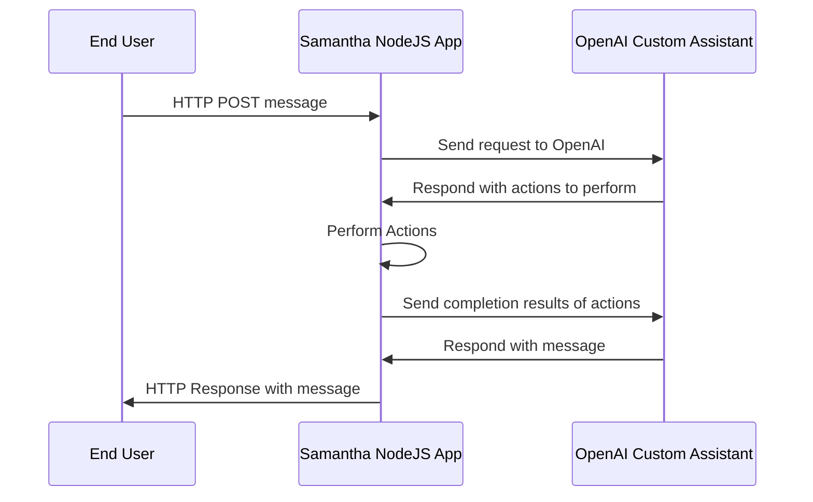

# Samantha — Connecting OpenAI Assistant with my digital ecosystem

[Part of the OpenAI Projects of @thomashermine](https://thomashermine.notion.site/OpenAI-Projects-30b950137c124b3c8fd0622007a889f0?pvs=4)

Samantha is a NodeJS app connecting OpenAI custom Asssistants with various third-party services : Google Calendar, Gmail/Google Mail, Slack, Spotify, HomeAssistant,...
It can be invoked via an iOS Shortcuts, or use as an HomeAssistant Conversation Agent.

## Architecture

## Documentation

[Complete Documentation](https://thomashermine.notion.site/Samantha-Connecting-OpenAI-Assistant-with-my-digital-ecosystem-202bff7ef3054ca5a5ceb9432e3e06d6?pvs=4)
